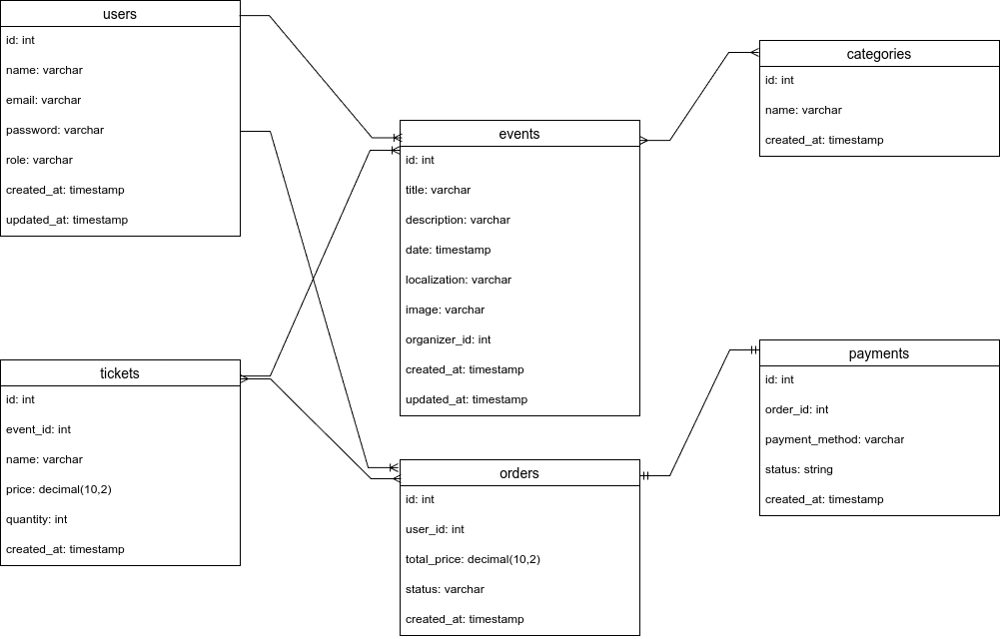

# Eventify

## Sobre o App

O Eventify é um aplicativo que permite seus usuários divulgarem eventos e manifestações culturais, como shows, mostras de cinema, peça de teatro entre outras atividades, permitindo que outros usuários possam encontrar atividades de seu interesse ou explorar novas.

- [ ] Cadastrar usuários, considerando os organizadores;
- [ ] Realizar login/logout;
- [ ] Permitir que os usuários organizadores criem eventos;
- [ ] Buscar eventos por localidade e categoria;
- [ ] Vizualizar detalhes de um evento;

Para futuras versões, seria permitido comprar um ingresso pelo app, contemplando os seguintes requisitos:

- [ ] Escolher um evento e comprar ingressos;
[Uploading eventify-database.drawio…]()

## Protótipos de tela

[Link para o protótipo do aplicativo](https://www.figma.com/design/4vb1z601jlP9PBRHRfRoah/Eventify?node-id=0-1&m=dev&t=N4RWWGNDrIP0DVrZ-1) 

## Modelagem do Banco de Dados

Banco de dados da aplicação. Será usado um banco de dados relacional, como o SQLite/Postgres.

## Planejamento das Sprints

- [ ] Prototipação das telas - 2 semanas
- [ ] Roteamento da aplicação - 1 semana
- [ ] Cadastro e login de usuários - 1 semana
- [ ] Permitir que usuário organizador crie e edite um evento - 1 semana;
- [ ] Mostrar os eventos cadastrados e mostrar detalhes de um evento - 1 semana
